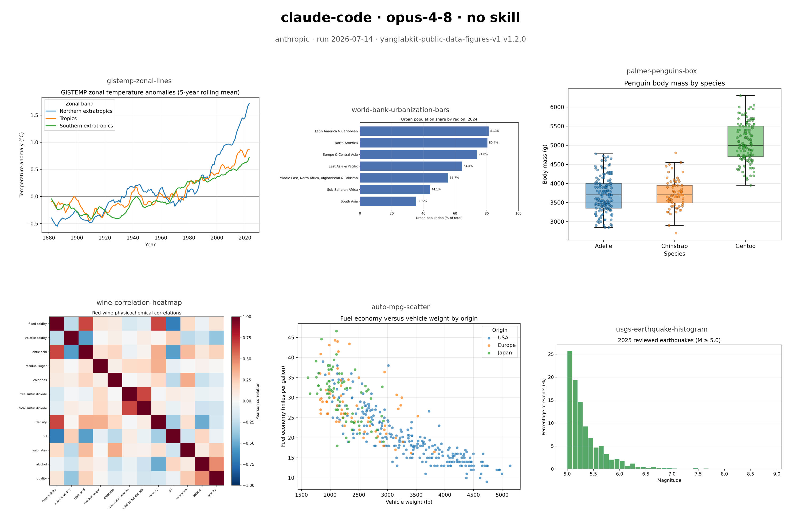
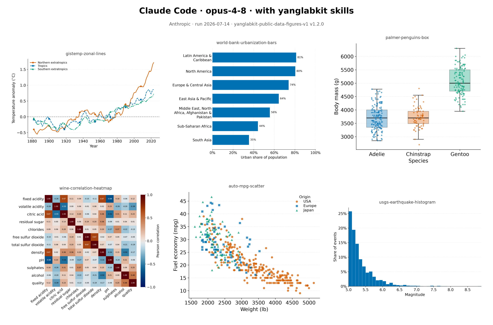

# Public-data figure comparison task

This is a versioned, agent-neutral task for comparing how different coding
agents apply YangLabKit's scientific-figure and scientific-colour guidance.
Every participant receives the same plot-ready data and output contract. The
task does not assume Claude Code, Codex, a particular prompt format, or a
specific programming language.

## Objective

Create one polished PNG for each of six figure types:

1. NASA GISTEMP zonal-anomaly line chart;
2. World Bank regional-urbanization horizontal bar chart;
3. Palmer Penguins body-mass box plot;
4. UCI red-wine correlation heatmap;
5. UCI Auto MPG weight-versus-economy scatter plot; and
6. USGS 2025 earthquake-magnitude percentage histogram.

The figures are visual demonstrations, not substantive scientific analyses.
Do not add causal or inferential claims.

## Normative guidance

Read and apply these repository-local documents before writing plotting code:

- [`yanglabkit-figures`](../../skills/yanglabkit-figures/SKILL.md) and its
  [full conventions](../../skills/yanglabkit-figures/reference/figure-conventions.md);
- [`yanglabkit-scicolor`](../../skills/yanglabkit-scicolor/SKILL.md) and its
  [selection guide](../../skills/yanglabkit-scicolor/reference/selection-guide.md).

The task-specific contract overrides a general skill default only where it says
so explicitly. These are web-gallery candidates, so 300 DPI PNG is required
even though the figure skill correctly prefers vector PDF for papers. The
agents remain responsible for visual and style decisions under the two
installed skills.

## Fixed inputs

Use only the committed files in [`data/`](data/). They are small, derived,
plot-ready snapshots made from the authoritative public sources documented in
[`data/README.md`](data/README.md). Do not fetch fresher values or substitute a
similar dataset: identical inputs are essential for comparison.

The exact data mappings, plot types, analytical constraints, and filenames are
machine-readable in [`task.json`](task.json). The essential transformations
have already been frozen into the inputs where doing so removes avoidable
analytical variation:

- the GISTEMP series already contain centered five-year rolling means;
- the World Bank regions are already sorted by the 2024 value;
- missing penguin body masses are already removed;
- the wine input is the fixed Pearson correlation matrix;
- Auto MPG origin codes are already mapped to labels; and
- the USGS input is the reviewed 2025 M≥5 event snapshot.

## Python environment with uv

The task includes a Python 3.12 environment defined by `pyproject.toml` and
locked by `uv.lock`. It provides matplotlib, NumPy, pandas, and seaborn for
candidate generation, plus the standard-library task utilities. Install
[`uv`](https://docs.astral.sh/uv/) and create the environment from the task
directory:

```bash
cd tasks/public-data-figure-comparison
uv sync --frozen
```

Run Python commands through the managed environment rather than system Python
or an ad hoc virtual environment:

```bash
uv run --frozen python submissions/<agent-harness>_<model>_<run-id>/source/<script>.py
uv run --frozen python validate_submission.py \
  submissions/<agent-harness>_<model>_<run-id>
uv run --frozen python build_comparison.py
```

Do not edit `pyproject.toml` or `uv.lock` during an individual candidate run.
This keeps Python-based submissions on the same dependency set. Record the
locked package versions and the reproduction command in `NOTES.md`. Agents may
use another programming language, but the committed validator and comparison
tools should still be run through this uv environment.

## Task contract and agent-owned style

`task.json` intentionally contains no prescribed visual styles. It fixes task
identity/version, 300 DPI PNG output, committed inputs, plot types, variable
mappings, analytical constraints, and the elements every figure must show so
the candidates remain comparable.

The agent must determine how to present those required elements by applying
`yanglabkit-figures` and `yanglabkit-scicolor`, including figure dimensions,
typography, backgrounds, titles, spines, ticks, grids, placement, marker/line
treatment, palette class, palette selection, and exact colours. Do not treat
choices made by another submission as guidance.

The shared non-style requirements are:

- Produce exactly the six 300 DPI PNG filenames listed in `task.json`.
- Use only the committed inputs and the mappings in `task.json`.
- Include every figure-specific element listed in each figure's `requirements`
  array in `task.json`.
- Record the agent-selected palette class, exact palette name, and hexadecimal
  colours in `submission.json` for later review.
- Retain the complete generating source and reproduction instructions.
- Do not redistribute additional upstream data inside a submission.

## Independent-run rule

Every candidate must be produced independently. During generation and
validation, the agent may read the task files, fixed inputs, canonical or
locally installed YangLabKit skills, repository instructions, and files inside
its own submission directory.

The agent must **not** list, search, open, read, diff, copy, execute, summarize,
or otherwise use:

- any sibling directory under `submissions/`;
- another candidate's figures, source code, notes, or metadata;
- `_comparison/`, its rendered review page, or its identity key; or
- prior submissions recovered from git history, remote branches, caches, or an
  external copy.

Do not revise a candidate after seeing another submission or comparison output.
If competing material is exposed accidentally, stop using it, record the
exposure in `NOTES.md`, and let the evaluator decide whether the run remains
comparable. The validator checks structure, not this behavioral rule; the
recommended safeguard is a clean worktree containing no prior candidate or
comparison outputs.

## Submission layout

Copy [`submission-template/`](submission-template/) to
`submissions/<agent-harness>_<model>_<run-id>/`, then replace its placeholders:

```text
submissions/<agent-harness>_<model>_<run-id>/
├── submission.json
├── NOTES.md
├── figures/
│   ├── gistemp-zonal-lines.png
│   ├── world-bank-urbanization-bars.png
│   ├── palmer-penguins-box.png
│   ├── wine-correlation-heatmap.png
│   ├── auto-mpg-scatter.png
│   └── usgs-earthquake-histogram.png
└── source/
    └── <the code used to generate all six figures>
```

The submission directory name and matching `submission_id` must identify the
agent harness and model used. Use a file-safe form such as
`<agent-harness>_<model>_<run-id>`; for example,
`codex_gpt-5_20260713-01` or `claude-code_claude-opus-4_20260713-01`. The run ID
distinguishes repeated attempts with the same harness/model pair. Record the
full harness, model, provider, date, and run reference in `submission.json`.
The metadata must also match the `task_id` and `task_version` in `task.json`.
The comparison builder copies images to anonymous slot paths, so descriptive
submission names do not reveal generator identity during scoring.

`NOTES.md` should briefly identify implementation choices, dependencies, and
any limitation. It must not contain a self-evaluation or instructions to the
reviewer.

## Validate and compare

From `tasks/public-data-figure-comparison/` after `uv sync --frozen`:

```bash
uv run --frozen python validate_submission.py \
  submissions/<agent-harness>_<model>_<run-id>

uv run --frozen python build_comparison.py
```

The comparison builder scans validator-passing submission layouts and writes a
local `_comparison/index.html` plus a separate identity key. Review candidates
with [`RUBRIC.md`](RUBRIC.md); do not inspect the identity key until scoring is
complete.

### Showcase images (after scoring)

```bash
uv run --frozen python build_showcase.py
```

The showcase builder writes one combined PNG per validator-passing submission
to the gitignored `_showcase/` directory — all six figures in a grid, annotated
with the agent, model, and skill setup. Pass `--only <submission-id>`
(repeatable) to rebuild a subset. The output is **identity-revealing by
design**: generate and share showcase images only after blinded rubric scoring
is complete, consistent with the identity-key rule above. Composites promoted
for display in this README are committed under the tracked
[`showcase/`](showcase/) directory, while `_showcase/` remains the gitignored
scratch default.

## Example outcomes

Six validator-passing submissions have been collected so far: four no-skill
baselines and two runs with the YangLabKit skills installed. The composites
below were regenerated with `build_showcase.py` and show one skill-vs-no-skill
pair from the same agent and model — Claude Code with Claude Opus 4.8. All six
figures per submission are shown in a single annotated grid.

**Claude Code, Opus 4.8, without skills:**



**Claude Code, Opus 4.8, with the yanglabkit-figures and yanglabkit-scicolor skills:**



Every submission's committed figures, source, palette metadata, and `NOTES.md`
are available under [`submissions/`](submissions/):

| Submission | Agent | Model | Skill setup |
|---|---|---|---|
| [`claude_code_fable-5_noskill`](submissions/claude_code_fable-5_noskill/) | Claude Code | Fable 5 | none (baseline) |
| [`claude_code_opus-4-8_noskill`](submissions/claude_code_opus-4-8_noskill/) | Claude Code | Opus 4.8 | none (baseline) |
| [`claude_code_opus-4-8_yanglabkit`](submissions/claude_code_opus-4-8_yanglabkit/) | Claude Code | Opus 4.8 | YangLabKit skills |
| [`codex_gpt-5-5_noskill`](submissions/codex_gpt-5-5_noskill/) | Codex | GPT-5.5 | none (baseline) |
| [`codex_gpt-5-6-sol_noskill`](submissions/codex_gpt-5-6-sol_noskill/) | Codex | GPT-5.6 (sol) | none (baseline) |
| [`codex_gpt-5-6-sol_yanglabkit`](submissions/codex_gpt-5-6-sol_yanglabkit/) | Codex | GPT-5.6 | YangLabKit skills |

Consistent with the list below, this section documents outcomes without
selecting winners or claiming that one agent is generally better.

## What is not part of this task

- editing the repository's public README;
- selecting winners or claiming that one agent is generally better;
- fetching or revising data;
- producing PDF/SVG versions;
- a tutorial, notebook collection, or scientific analysis; or
- changing either YangLabKit skill to suit a submission.
